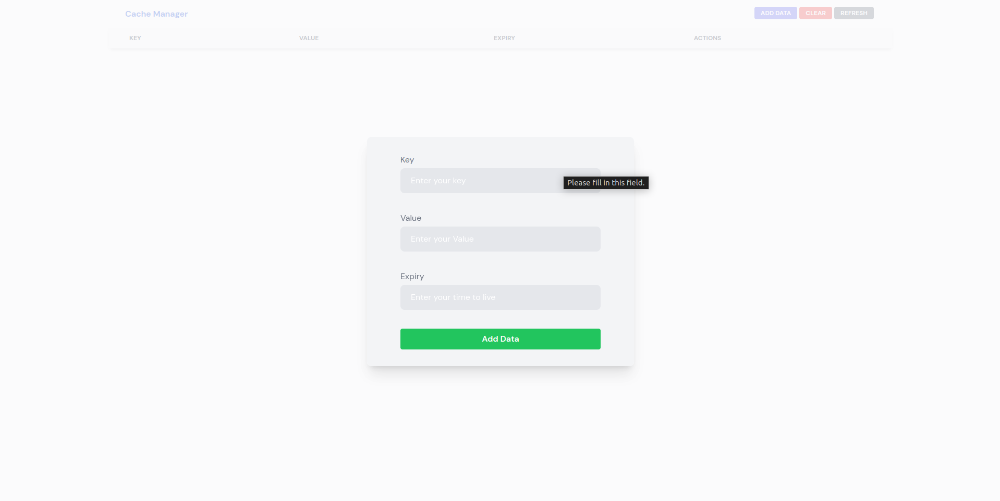
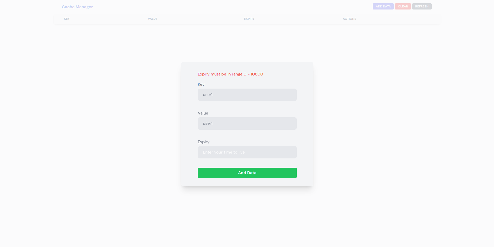
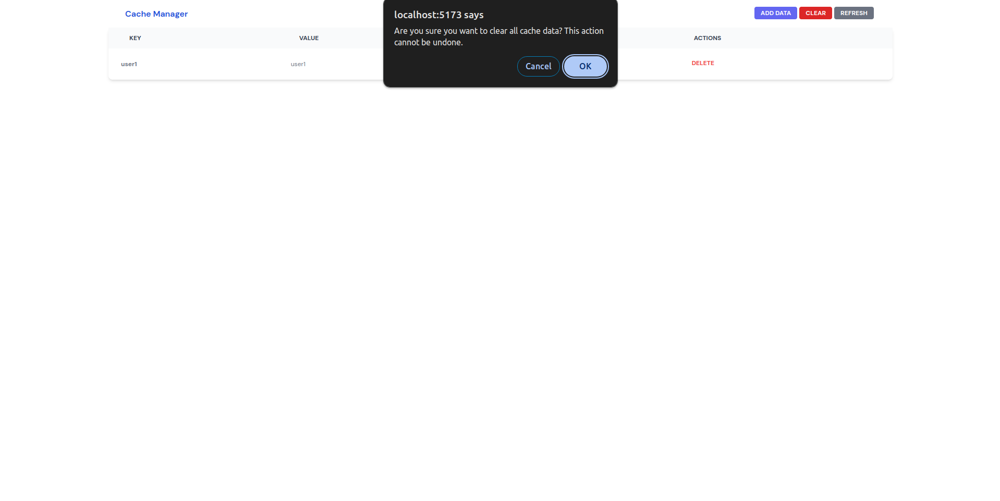
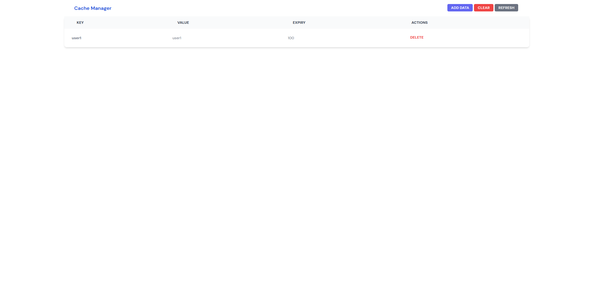

# Documentation for `apica-assignment` Repository

## Overview

This repository contains a Go-based backend (`go-lru-cache`) that implements an LRU cache and provides an API for interacting with it, as well as a React-based frontend (`lru-cache-viewer`) using the Vite framework to interact with this API.

## Repository Structure

```
apica-assignment/
│
├── go-lru-cache/          # Go backend implementation
│   ├── cmd/
│   │   └── main.go
│   ├── internal/
│   │   ├── cache/
│   │   │   └── iCache.go
│   │   │   └── lru_cache.go
│   │   ├── controllers/
│   │   │   └── cache_controller.go
│   │   ├── middleware/
│   │   │   └── common.go
│   │   │   └── cors.go
│   │   ├── models/
│   │   │   └── icache_model.go
│   │   └── routers/
│   │       └── router.go
│   ├── pkg/
│   │   └── utils/
│   │       └── constants.go
│   ├── go.mod
│   └── go.sum
│
└── lru-cache-viewer/       # React frontend implementation using Vite
```

## Getting Started

### 1. Clone the Repository

First, clone the repository to your local machine:

```bash
git clone https://github.com/Rahul-singh98/apica-assignment.git
cd apica-assignment
```

### 2. Backend (`go-lru-cache`)

#### Prerequisites

Ensure you have Go installed on your machine. You can download it from [golang.org](https://golang.org/dl/).

#### Installation

Navigate to the `go-lru-cache` directory and install the Go modules:

```bash
cd go-lru-cache
go mod tidy
```

#### Running the Backend

Start the Go backend server:

```bash
go run cmd/main.go
```

By default, the backend server will be available at `http://localhost:8080`.

### 3. Frontend (`lru-cache-viewer`)

#### Prerequisites

Ensure you have Node.js and npm (or Yarn) installed. You can download them from [nodejs.org](https://nodejs.org/).

#### Installation

Navigate to the `lru-cache-viewer` directory and install the dependencies:

```bash
cd lru-cache-viewer
npm install
```

#### Running the Frontend

Start the Vite development server:

```bash
npm run dev
```

By default, the frontend application will be available at `http://localhost:5173/`.

## Using the Application

### Frontend

1. **Table of Cache Data**: The table displays the current data stored in the cache.
   

2. **Add Data**: Click the "Add Data" button to open a modal where you can input new data to be added to the cache.
   

---



3. **Clear Data**: Click the "Clear" button to remove all data from the cache.
   

4. **Refresh Data**: Click the "Refresh" button to manually refresh the cache data. Data is also automatically refreshed every 10 seconds.
   

### Backend API

- **GET /api/cache**: Retrieves all key-value pairs from the cache.
- **POST /api/cache**: Adds a new key-value pair to the cache. Requires JSON body with `key`, `value` and `expiry`.
- **DELETE /api/cache**: Clears all data from the cache.

## Troubleshooting

- **Backend Not Starting**: Ensure that no other process is using port 8080 and that all Go modules are properly installed.
- **Frontend Not Loading**: Ensure that the backend server is running and accessible at `http://localhost:5173/`.
